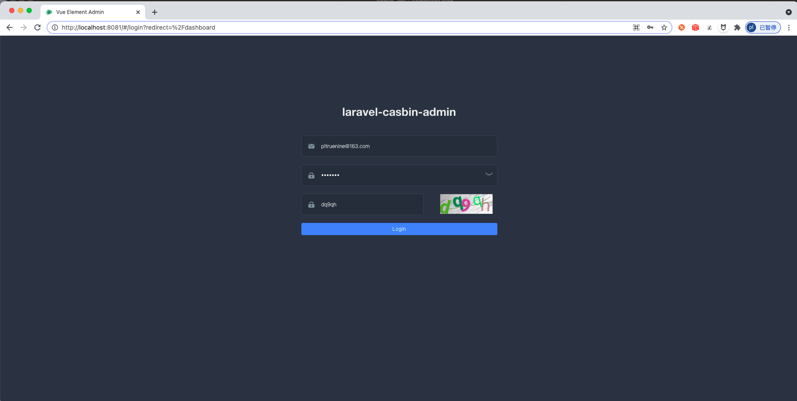
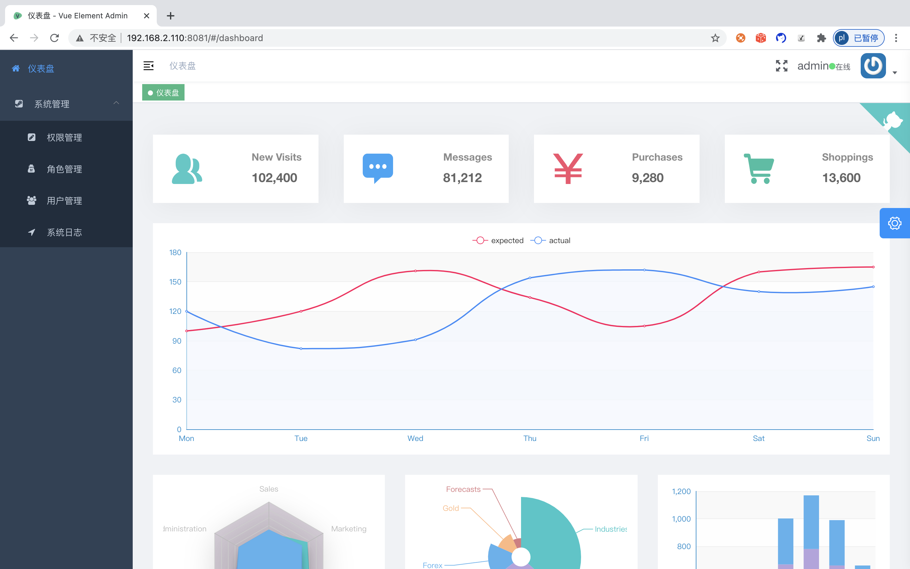
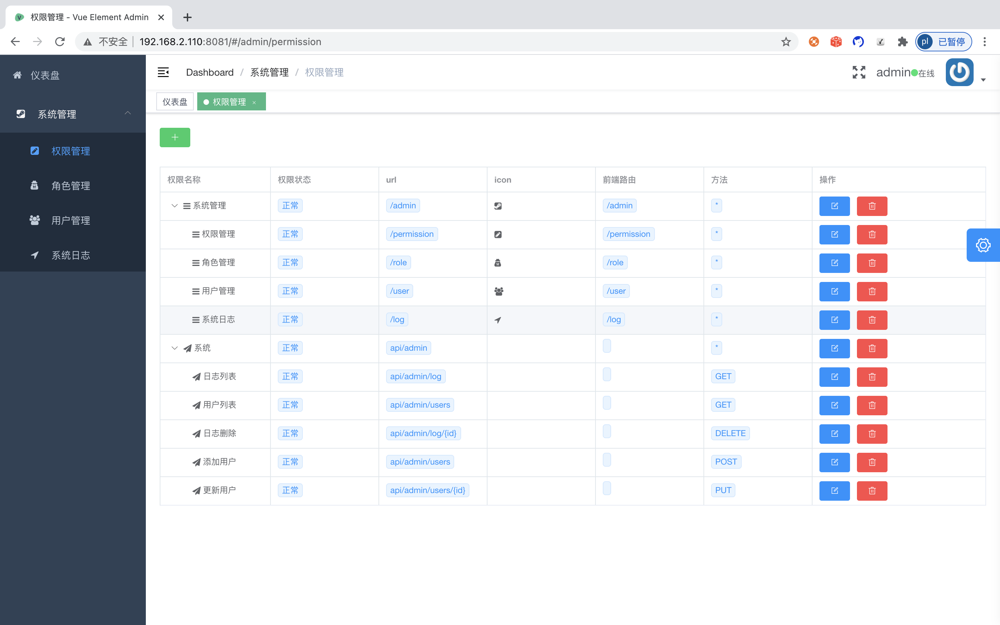
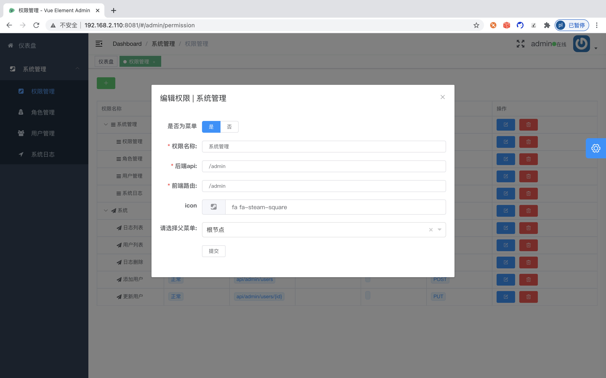
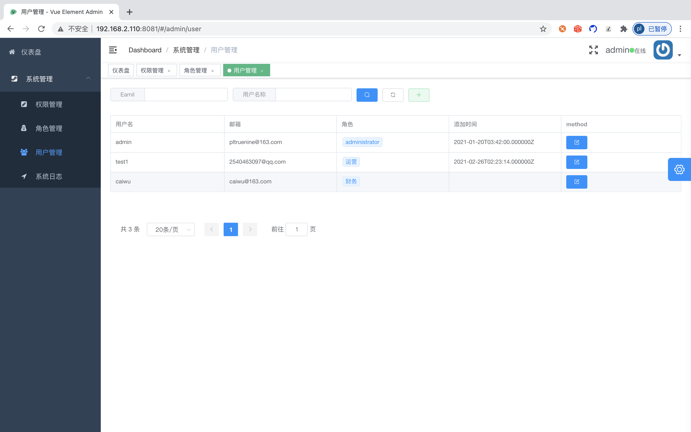
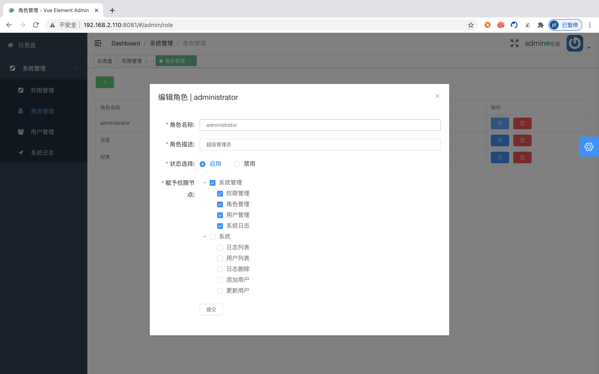
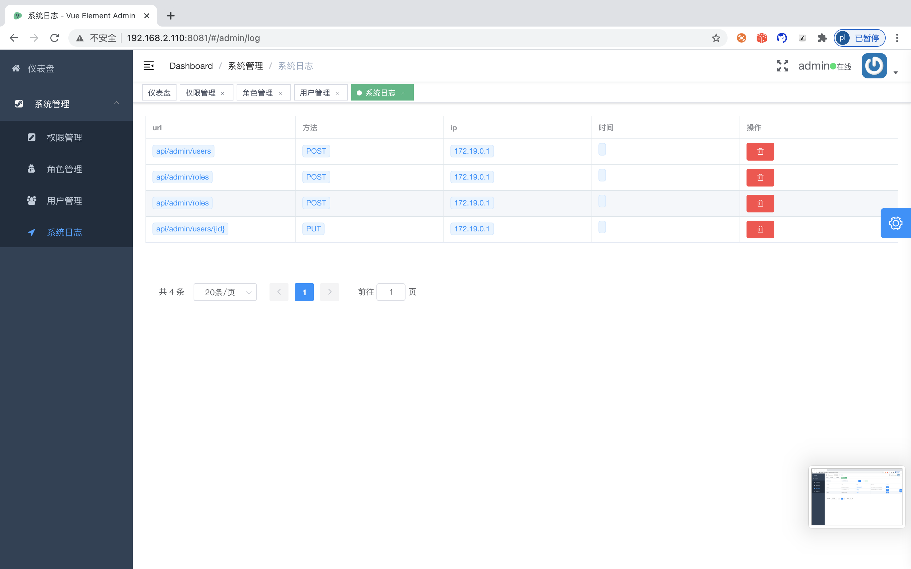

<h1 align="center">laravel-casbin-admin</h1>

<p align="center">

<a href="https://packagist.org/packages/pltrue/thirdparty_oauth"></a> 
<a href="https://packagist.org/packages/pltrue/thirdparty_oauth"></a> 
</p>


基于 [vue-element-admin](https://panjiachen.github.io/vue-element-admin-site/zh/) 
[laravel](https://laravel.com/)
[jwt]()
[casbin](https://github.com/php-casbin/laravel-authz) 
整合的前后端分离的rbac权限管理系统
  
## 演示站点 
  * [线上demo](http://system.pltrue.top)
  * 账号:`admin@gmail.com` 密码:`123456`
  

#### 后台界面登录























### 安装使用
```shell script
$ git clone https://github.com/pl1998/laravel-casbin-admin.git
```
### 后端环境配置 
```shell script
$ cd /laravel-casbin-admin/web/vue-element-admin/
$ cp .env.example .env #配置文件
$ composer update #更新包
$ php artisan key:gen #更新密钥
$ chown -R 777 storage #更改权限目录
```
> nginx配置文件、以及数据库文件在项目根目录下 可以打开作为参考:基于宝塔安装 本地环境是[laradock](https://laradock-docs.linganmin.cn/)
### 前端配置
```shell script
$ git clone  https://github.com/pl1998/vue_system.git # 克隆项目
$ cd vue_system
$ vim .env.development #测试环境域名
 -- 如下
VUE_APP_HOST = 'http://system.pltrue.top/api'
$ vim .env.production  #正式环境域名
 -- 如下
VUE_APP_HOST = 'http://system.pltrue.top/api'

```
### 打包项目
```shell script
$ npm run dev #本地热开发
$ npm run build:prod #打包编译
$ cp -r dist 后端项目/resources/dist 目录下

```
### 最后可以给我点个star吗～❤️


