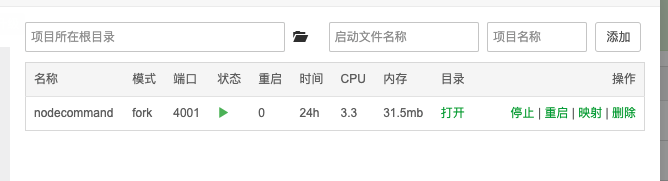

## 安装部署

### 安装要求
  * =<php7.3
  * mysql5.7+
  * redis
  * node(非必须)
  
### 安装使用
```shell script
$ git clone https://github.com/pl1998/laravel-casbin-admin.git
```


### 后端环境配置 
```shell script
$ cd laravel-casbin-admin
$ cp .env.example .env #配置文件
$ composer install #更新包
$ php artisan key:gen #更新密钥
$ chown -R 777 storage #更改权限目录
$ php bin/laravels start #php swoole模式运行
```

### 问题
如果composer install 失败
```shell
// 删除 composer.lock
rm -rf  composer.lock
//执行
composer install
```


> nginx配置文件、以及数据库文件在项目根目录下 可以打开作为参考:线上宝塔部署 本地环境是[laradock](https://laradock-docs.linganmin.cn/)
### 前端配置
```shell script
$ git clone  https://github.com/pl1998/vue_system.git # 克隆项目
$ cd vue_system
$ vim .env.development #测试环境域名
 -- 如下
VUE_APP_HOST = 'http://system.pltrue.top/api'
$ vim .env.production  #正式环境域名
 -- 如下
VUE_APP_HOST = 'http://system.pltrue.top/api'

```

### [问题解决:https://github.com/pl1998/vue_admin/issues](https://github.com/pl1998/vue_admin/issues)


### 打包项目
```shell script
$ npm run dev #本地热开发
$ npm run build:prod #打包编译
$ cp -r dist 后端项目/resources/dist 目录下

```

### 重置密码为`123456`
  * 超级管理员 `pltruenine@163.com` `123456`
```shell script
php artisan admin:install
```

### 命令行终端

> 使用pm2工具进行node服务维护 该功能需要暴露端口`4001`端口
>
> 用户需要授权该`api/admin/terminal`接口才能访问终端

  #### 端口调整
  * 配置 vue `env` 中 `VUE_APP_WS_HOST`参数调整端口
  * 修改api项目 `terminal.js`中`ws`监听的端口
  
```shell script
npm install
node terminal.js 
```
#### 使用pm2工具进行node服务维护该命令


